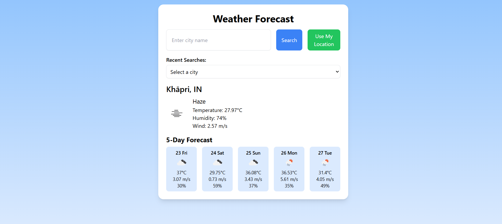
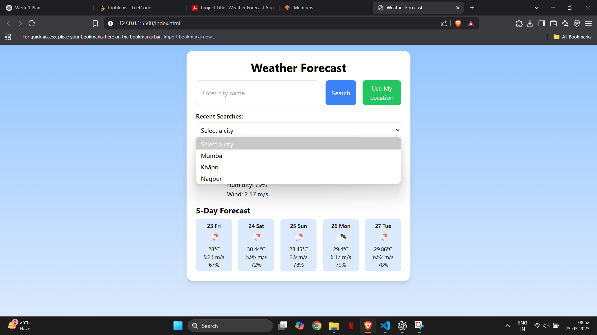
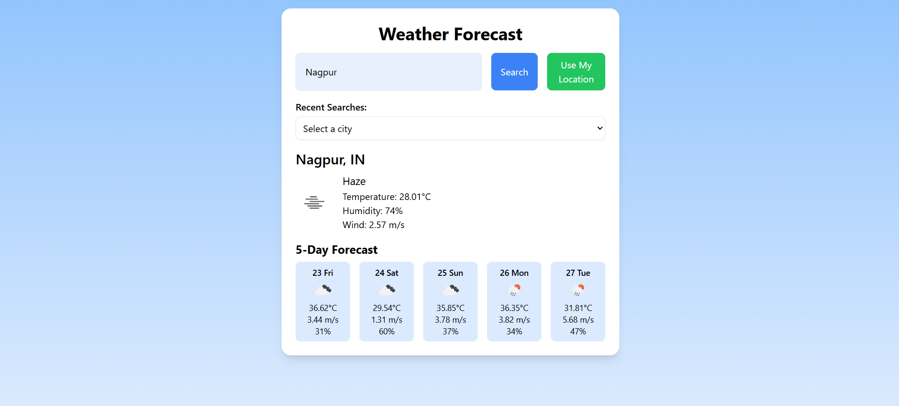

# Weather Forecast Application 🌤️

This is a simple and responsive weather forecast application built using **HTML**, **Tailwind CSS**, and **JavaScript**. It uses the **OpenWeatherMap API** to fetch current weather data and a 5-day forecast.

## 🚀 Features

- 🌍 Get weather by **city name** or **current location**
- 📅 Shows **5-day forecast** with weather details
- 💾 **Recent searches** saved using localStorage
- 🔁 **Responsive UI** for desktop, tablet, and mobile devices
- 🎨 Clean design using **Tailwind CSS**
- ❌ Graceful error handling for invalid inputs or failed requests

---

## 📁 File Structure

```
weather-app/
│
├── index.html        # Main HTML file
├── script.js         # JavaScript logic
└── README.md         # This file
```

---

## 📷 Screenshots
- Using My Location


- Recent Search


- Using City Search



